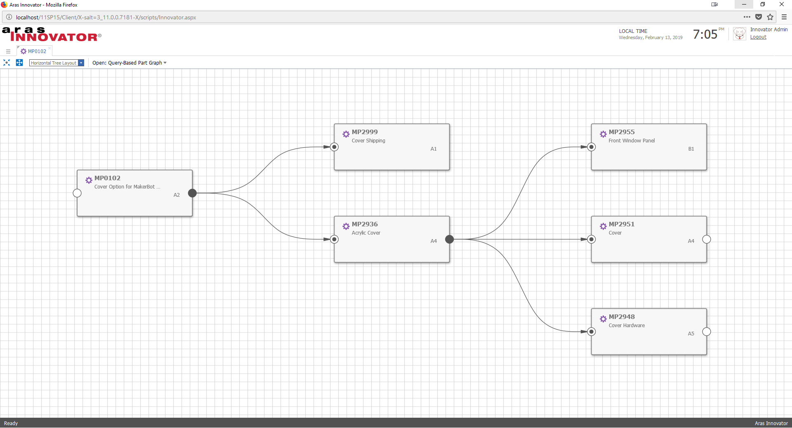

# Introduction to Graph Navigation

Graph Navigation is a platform service introduced in Aras Innovator 11.0 SP15 that allows users to quickly visualize and navigate data structures via a node-edge graph. This community project contains several samples to demonstrate how to configure and style Graph Views.

For more detail on Graph Navigation in Aras Innovator, check out these resources:
* Blog Post: [Getting Started with Graph Navigation](https://community.aras.com/b/english/posts/getting-started-with-graph-navigation)
* Blog Post: [Customizing Aras Graph Navigation Views](https://community.aras.com/b/english/posts/customizing-aras-graph-navigation-views)
* Coming Soon: Demo Series webinar recording
* Coming Soon: View Card Editor community project

## History

Release | Notes
--------|--------
[v1.0.0](https://github.com/ArasLabs/intro-to-graph-nav/releases/tag/v1.0.0) | First release.

#### Supported Aras Versions

Project | Aras
--------|------
[v1.0.0](https://github.com/ArasLabs/intro-to-graph-nav/releases/tag/v1.0.0) | 11.0 SP15

## Installation

#### Important!
**Always back up your code tree and database before applying an import package or code tree patch!**

### Pre-requisites

1. Aras Innovator installed
2. Aras Package Import Utility
3. aras.labs.graph_nav.examples package

### Install Steps

1. Backup your database and store the BAK file in a safe place.
2. Open up the Aras Package Import tool.
3. Enter your login credentials and click **Login**
    * _Note: You must login as root for the package import to succeed!_
4. Enter the package name in the TargetRelease field.
    * Optional: Enter a description in the Description field.
5. Enter the path to your local `..\intro-to-graph-nav\Import\imports.mf` file in the Manifest File field.
6. Select the following in the Available for Import field.
    * **aras.labs.graph_nav.examples**
7. Select Type = **Merge** and Mode = **Thorough Mode**.
8. Click **Import** in the top left corner.
9. Close the Aras Package Import tool.

You are now ready to login to Aras and check out the included Graph Navigation examples.

## Usage

### Example 1: Default Ad Hoc Graph
The built-in `gn_ShowGraphView` action automatically exposes the default Ad Hoc graph view. To add this "Show Graph" action to an ItemType, follow the steps below: 

1. Navigate to **Administration > ItemTypes** in the TOC.
2. Search for the Part ItemType and open it for editing.
3. Select the **Actions** tab and click the **Add New** button to pick a related Action.
4. Search for the **gn_ShowGraphView** Action and double click to add it to the Part ItemType's actions.
5. Save and close the Part ItemType.

Now we'll be able to view Parts and their related data using Aras Innovator's default graph settings.

1. Navigate to **Design > Parts** in the TOC.
2. Search for the Part you want to view in a graph view and open it.
3. Select **Actions > Show Graph** from the main menu.
    * You can also run the action from the main grid context menu.

A graph view should open in a new tab, with the context item at the center. From here you can use the graph viewer to expand and collapse the data structure.

### Example 2: Sample Ad Hoc Graph
This project includes an example of a custom Ad Hoc graph view for Parts. Once you've added the `gn_ShowGraphView` action to the Part ItemType in Example 1, we can also view this graph.  

1. Navigate to **Design > Parts** in the TOC.
2. Search for the Part you want to view in a graph view and open it.
3. Select **Actions > Show Graph** from the main menu.
4. When the graph opens, select the Ad Hoc Graph view from the view selector in the toolbar.

### Example 3: Sample Query-Based Graph
This project includes an example of a Query-Based graph view for Part BOM structures. The import package also includes a custom action to open the graph view directly from the context item instead of opening the default graph first (like Example 2).

1. Navigate to **Design > Parts** in the TOC.
2. Search for the Part you want to view in a graph view and open it.
3. Select **Actions > Show My Query Graph** from the main menu.

## Contributing

1. Fork it!
2. Create your feature branch: `git checkout -b my-new-feature`
3. Commit your changes: `git commit -am 'Add some feature'`
4. Push to the branch: `git push origin my-new-feature`
5. Submit a pull request

For more information on contributing to this project, another Aras Labs project, or any Aras Community project, shoot us an email at araslabs@aras.com.

## Credits

Created by Eli Donahue for Aras Labs. @EliJDonahue

Other Contributors:
- Eugene Linkov, Aras Corporation

## License

Aras Labs projects are published to Github under the MIT license. See the [LICENSE file](./LICENSE.md) for license rights and limitations.